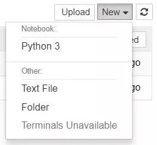

Lab 1: Data Analysis in a Jupyter Notebook
------------------------------------------

### Example Data Analysis in a Jupyter Notebook

First, we will walk through setup and a sample analysis to answer a
real-life question. This will demonstrate how the flow of a notebook
makes data science tasks more intuitive for us as we work, and for
others once it's time to share our work.

So, let's say you're a data analyst and you've been tasked with finding
out how the profits of the largest companies in the US changed
historically. You find a data set of Fortune 500 companies spanning over
50 years since the list's first publication in 1955, put together
from [Fortune's public archive](https://archive.fortune.com/magazines/fortune/fortune500_archive/full/2005/).
We've gone ahead and created a CSV of the data you can
use [here](https://s3.amazonaws.com/dq-blog-files/fortune500.csv).


#### Pre-reqs:
- Google Chrome (Recommended)

#### Lab Environment
Notebooks are ready to run. All packages have been installed. There is no requirement for any setup.

All notebooks are present in `~/work/data-jungle/Lab_1` folder. 


Creating Your First Notebook
----------------------------

The dashboard's interface is mostly self-explanatory --- though we will
come back to it briefly later. Browse to the
folder in which you would like to create your first notebook, click the
"New" drop-down button in the top-right and select "Python 3":



Hey presto, here we are! Your first Jupyter Notebook will open in new
tab --- each notebook uses its own tab because you can open multiple
notebooks simultaneously.

If you switch back to the dashboard, you will see the new file
`Untitled.ipynb` and you should see some green text that tells you your
notebook is running.


### The Notebook Interface

Now that you have an open notebook in front of you, its interface will
hopefully not look entirely alien. After all, Jupyter is essentially
just an advanced word processor.

Why not take a look around? Check out the menus to get a feel for it,
especially take a few moments to scroll down the list of commands in the
command palette, which is the small button with the keyboard icon (or
`Ctrl + Shift + P`).


There are two fairly prominent terms that you should notice, which are
probably new to you: *cells* and *kernels* are key both to understanding
Jupyter and to what makes it more than just a word processor.
Fortunately, these concepts are not difficult to understand.

-   A **kernel** is a "computational engine" that executes the code
    contained in a notebook document.
-   A **cell** is a container for text to be displayed in the notebook
    or code to be executed by the notebook's kernel.

### Cells

We'll return to kernels a little later, but first let's come to grips
with cells. Cells form the body of a notebook. In the screenshot of a
new notebook in the section above, that box with the green outline is an
empty cell.

The first cell in a new notebook is always a code cell.

Let's test it out with a classic hello world example: Type
`print('Hello World!')` into the cell and click the run
button  in the
toolbar above or press `Ctrl + Enter`.

The result should look like this:

```
print('Hello World!')
```

    Hello World!

When we run the cell, its output is displayed below and the label to its
left will have changed from `In [ ]` to `In [1]`.

The output of a code cell also forms part of the document, which is why
you can see it in this article. You can always tell the difference
between code and Markdown cells because code cells have that label on
the left and Markdown cells do not.

The "In" part of the label is simply short for "Input," while the label
number indicates *when* the cell was executed on the kernel --- in this
case the cell was executed first.

Run the cell again and the label will change to `In [2]` because now the
cell was the second to be run on the kernel. It will become clearer why
this is so useful later on when we take a closer look at kernels.

From the menu bar, click *Insert* and select *Insert Cell Below* to
create a new code cell underneath your first and try out the following
code to see what happens. Do you notice anything different?

```
import time
time.sleep(3)
```

This cell doesn't produce any output, but it does take three seconds to
execute. Notice how Jupyter signifies when the cell is currently running
by changing its label to `In [*]`.

In general, the output of a cell comes from any text data specifically
printed during the cell's execution, as well as the value of the last
line in the cell, be it a lone variable, a function call, or something
else. For example:

```
def say_hello(recipient):
    return 'Hello, {}!'.format(recipient)

say_hello('Tim')
```

    'Hello, Tim!'

You'll find yourself using this almost constantly in your own projects,
and we'll see more of it later on.


### Kernels

Behind every notebook runs a kernel. When you run a code cell, that code
is executed within the kernel. Any output is returned back to the cell
to be displayed. The kernel's state persists over time and between cells
--- it pertains to the document as a whole and not individual cells.

For example, if you import libraries or declare variables in one cell,
they will be available in another. Let's try this out to get a feel for
it. First, we'll import a Python package and define a function:

```
import numpy as np
def square(x):
    return x * x
```

Once we've executed the cell above, we can reference `np` and `square`
in any other cell.

```
x = np.random.randint(1, 10)
y = square(x)
print('%d squared is %d' % (x, y))
```

    1 squared is 1

This will work regardless of the order of the cells in your notebook. As
long as a cell has been run, any variables you declared or libraries you
imported will be available in other cells.

You can try it yourself, let's print out our variables again.

```
print('Is %d squared %d?' % (x, y))
```

    Is 1 squared 1?

No surprises here! But what happens if we change the value of  `y?`

```
y = 10
print('Is %d squared is %d?' % (x, y))
```

If we run the cell above, what do you think would happen?

We will get an output like: `Is 4 squared 10?`. This is because once
we've run the `y = 10` code cell, `y` is no longer equal to the square
of x in the kernel.

Most of the time when you create a notebook, the flow will be
top-to-bottom. But it's common to go back to make changes. When we do
need to make changes to an earlier cell, the order of execution we can
see on the left of each cell, such as `In [6]`, can help us diagnose
problems by seeing what order the cells have run in.

And if we ever wish to reset things, there are several incredibly useful
options from the Kernel menu:

-   Restart: restarts the kernel, thus clearing all the variables etc
    that were defined.
-   Restart & Clear Output: same as above but will also wipe the output
    displayed below your code cells.
-   Restart & Run All: same as above but will also run all your cells in
    order from first to last.

If your kernel is ever stuck on a computation and you wish to stop it,
you can choose the Interrupt option.


Example Analysis
----------------

Now we've looked at *what* a Jupyter Notebook is, it's time to look
at *how* they're used in practice, which should give us clearer
understanding of *why* they are so popular.

It's finally time to get started with that Fortune 500 data set
mentioned earlier. Remember, our goal is to find out **how the profits
of the largest companies in the US changed historically**.

It's worth noting that everyone will develop their own preferences and
style, but the general principles still apply. You can follow along with
this section in your own notebook if you wish, or use this as a guide to
creating your own approach.

### Naming Your Notebooks

Before you start writing your project, you'll probably want to give it a
meaningful name. file name `Untitled` in the upper left of the screen to
enter a new file name, and hit the Save icon (which looks like a floppy
disk) below it to save.

Note that closing the notebook tab in your browser will **not** "close"
your notebook in the way closing a document in a traditional application
will. The notebook's kernel will continue to run in the background and
needs to be shut down before it is truly "closed" --- though this is
pretty handy if you accidentally close your tab or browser!

If the kernel is shut down, you can close the tab without worrying about
whether it is still running or not.

The easiest way to do this is to select "File \> Close and Halt" from
the notebook menu. However, you can also shutdown the kernel either by
going to "Kernel \> Shutdown" from within the notebook app or by
selecting the notebook in the dashboard and clicking "Shutdown" (see
image below).


### Setup

It's common to start off with a code cell specifically for imports and
setup, so that if you choose to add or change anything, you can simply
edit and re-run the cell without causing any side-effects.

```
%matplotlib inline
import pandas as pd
import matplotlib.pyplot as plt
import seaborn as sns sns.set(style="darkgrid")
```

We'll import [pandas](https://pandas.pydata.org/) to work with our
data, [Matplotlib](https://matplotlib.org/) to plot charts,
and [Seaborn](https://seaborn.pydata.org/) to make our charts prettier.
It's also common to import [NumPy](https://www.numpy.org/) but in this
case, pandas imports it for us.

That first line isn't a Python command, but uses something called a line
magic to instruct Jupyter to capture Matplotlib plots and render them in
the cell output.

For now, let's go ahead and load our data.

```
df = pd.read_csv('fortune500.csv')
```

It's sensible to also do this in a single cell, in case we need to
reload it at any point.


### Investigating Our Data Set

Now we're really rolling! Our notebook is safely saved and we've loaded
our data set `df` into the most-used pandas data structure, which is
called a `DataFrame` and basically looks like a table. What does ours
look like?

```
df.head()


  Year   Rank   Company   Revenue (in millions)   Profit (in millions)
  ------ ------ --------- ----------------------- ----------------------
  0      1955   1         General Motors          9823.5
  1      1955   2         Exxon Mobil             5661.4
  2      1955   3         U.S. Steel              3250.4
  3      1955   4         General Electric        2959.1
  4      1955   5         Esmark                  2510.8
```
 

```
df.tail()


  Year    Rank   Company   Revenue (in millions)   Profit (in millions)
  ------- ------ --------- ----------------------- ----------------------
  25495   2005   496       Wm. Wrigley Jr.         3648.6
  25496   2005   497       Peabody Energy          3631.6
  25497   2005   498       Wendy's International   3630.4
  25498   2005   499       Kindred Healthcare      3616.6
  25499   2005   500       Cincinnati Financial    3614.0
```

Looking good. We have the columns we need, and each row corresponds to a
single company in a single year.

Let's just rename those columns so we can refer to them later.

```
df.columns = ['year', 'rank', 'company', 'revenue', 'profit']
```

Next, we need to explore our data set. Is it complete? Did pandas read
it as expected? Are any values missing?

```
len(df)
```

    25500

Okay, that looks good --- that's 500 rows for every year from 1955 to
2005, inclusive.

Let's check whether our data set has been imported as we would expect. A
simple check is to see if the data types (or dtypes) have been correctly
interpreted.

```
df.dtypes
```

    year int64 rank int64 company object revenue float64 profit object dtype: object

Uh oh. It looks like there's something wrong with the profits column ---
we would expect it to be a `float64` like the revenue column. This
indicates that it probably contains some non-integer values, so let's
take a look.

```
non_numberic_profits = df.profit.str.contains('[^0-9.-]')
df.loc[non_numberic_profits].head()


  year   rank   company   revenue                 profit
  ------ ------ --------- ----------------------- --------
  228    1955   229       Norton                  135.0
  290    1955   291       Schlitz Brewing         100.0
  294    1955   295       Pacific Vegetable Oil   97.9
  296    1955   297       Liebmann Breweries      96.0
  352    1955   353       Minneapolis-Moline      77.4
```

Just as we suspected! Some of the values are strings, which have been
used to indicate missing data. Are there any other values that have
crept in?

```
set(df.profit[non_numberic_profits])
```

    {'N.A.'}

That makes it easy to interpret, but what should we do? Well, that
depends how many values are missing.

```
len(df.profit[non_numberic_profits])
```

    369

It's a small fraction of our data set, though not completely
inconsequential as it is still around 1.5%.

If rows containing `N.A.` are, roughly, uniformly distributed over the
years, the easiest solution would just be to remove them. So let's have
a quick look at the distribution.

```
bin_sizes, _, _ = plt.hist(df.year[non_numberic_profits], bins=range(1955, 2006))
```


At a glance, we can see that the most invalid values in a single year is
fewer than 25, and as there are 500 data points per year, removing these
values would account for less than 4% of the data for the worst years.
Indeed, other than a surge around the 90s, most years have fewer than
half the missing values of the peak.

For our purposes, let's say this is acceptable and go ahead and remove
these rows.

```
df = df.loc[~non_numberic_profits]
df.profit = df.profit.apply(pd.to_numeric)
```

We should check that worked.

```
len(df)
```

    25131

```
df.dtypes
```

    year int64 rank int64 company object revenue float64 profit float64 dtype: object

Great! We have finished our data set setup.

If we were going to present your notebook as a report, we could get rid
of the investigatory cells we created, which are included here as a
demonstration of the flow of working with notebooks, and merge relevant
cells (see the Advanced Functionality section below for more on this) to
create a single data set setup cell.

This would mean that if we ever mess up our data set elsewhere, we can
just rerun the setup cell to restore it.

### Plotting with matplotlib

Next, we can get to addressing the question at hand by plotting the
average profit by year. We might as well plot the revenue as well, so
first we can define some variables and a method to reduce our code.

```
group_by_year = df.loc[:, ['year', 'revenue', 'profit']].groupby('year')
avgs = group_by_year.mean()
x = avgs.index
y1 = avgs.profit
def plot(x, y, ax, title, y_label):
    ax.set_title(title)
    ax.set_ylabel(y_label)
    ax.plot(x, y)
    ax.margins(x=0, y=0)
```

Now let's plot!

```
fig, ax = plt.subplots()
plot(x, y1, ax, 'Increase in mean Fortune 500 company profits from 1955 to 2005', 'Profit (millions)')
```


Wow, that looks like an exponential, but it's got some huge dips. They
must correspond to the [early 1990s
recession](https://en.wikipedia.org/wiki/Early_1990s_recession) and
the [dot-com bubble](https://en.wikipedia.org/wiki/Dot-com_bubble). It's
pretty interesting to see that in the data. But how come profits
recovered to even higher levels post each recession?

Maybe the revenues can tell us more.

```
y2 = avgs.revenue
fig, ax = plt.subplots()
plot(x, y2, ax, 'Increase in mean Fortune 500 company revenues from 1955 to 2005', 'Revenue (millions)')
```


That adds another side to the story. Revenues were not as badly hit ---
that's some great accounting work from the finance departments.

We can superimpose these plots with +/- their standard deviations.

```
def plot_with_std(x, y, stds, ax, title, y_label):
    ax.fill_between(x, y - stds, y + stds, alpha=0.2)
    plot(x, y, ax, title, y_label)
fig, (ax1, ax2) = plt.subplots(ncols=2)
title = 'Increase in mean and std Fortune 500 company %s from 1955 to 2005'
stds1 = group_by_year.std().profit.values
stds2 = group_by_year.std().revenue.values
plot_with_std(x, y1.values, stds1, ax1, title % 'profits', 'Profit (millions)')
plot_with_std(x, y2.values, stds2, ax2, title % 'revenues', 'Revenue (millions)')
fig.set_size_inches(14, 4)
fig.tight_layout()
```


That's staggering, the standard deviations are huge! Some Fortune 500
companies make billions while others lose billions, and the risk has
increased along with rising profits over the years.

Perhaps some companies perform better than others; are the profits of
the top 10% more or less volatile than the bottom 10%?


Sharing Your Notebooks
----------------------

To ensure that your notebook is share-ready, so to speak, there are a few
steps you should take before sharing:

1.  Click "Cell \> All Output \> Clear"
2.  Click "Kernel \> Restart & Run All"
3.  Wait for your code cells to finish executing and check ran as
    expected

This will ensure your notebooks don't contain intermediary output, have
a stale state, and execute in order at the time of sharing.

### Exporting Your Notebooks

Jupyter has built-in support for exporting to HTML and PDF as well as
several other formats, which you can find from the menu under "File \>
Download As."
