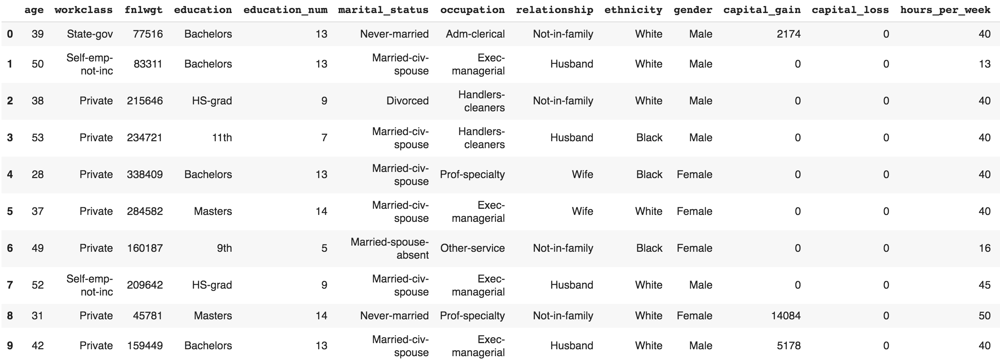
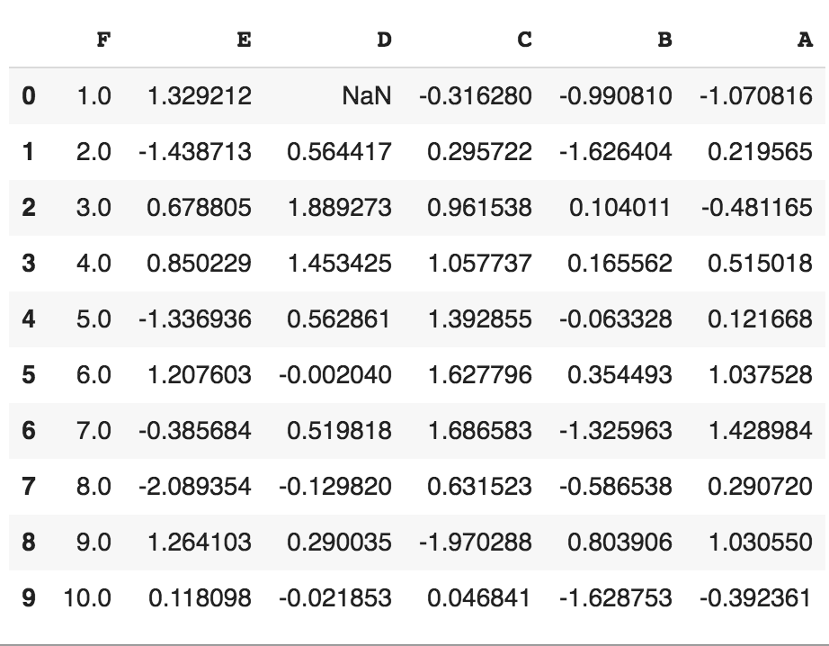
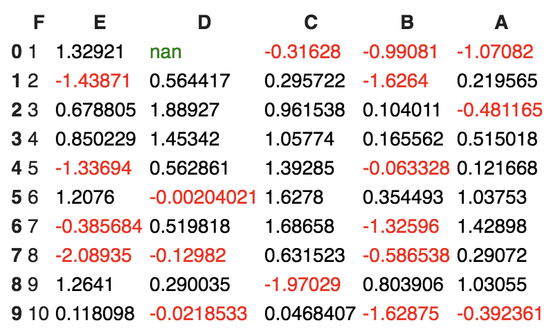
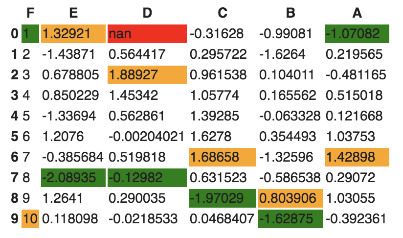
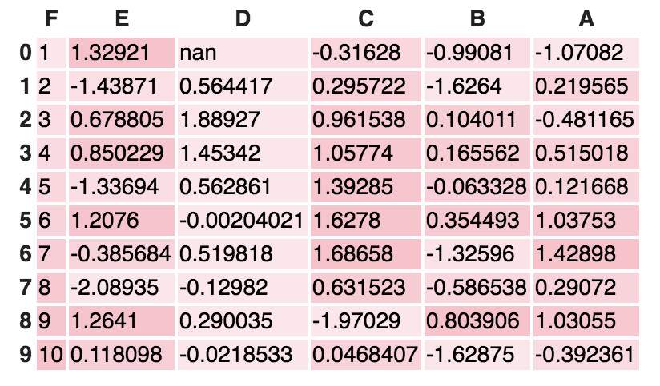

Lab 2: Exploratory Data Analysis
================================

In this lab, we are going to learn about EDA.

#### Pre-reqs:
- Google Chrome (Recommended)

#### Lab Environment
Notebooks are ready to run. All packages have been installed. There is no requirement for any setup.

All notebooks are present in `~/work/data-jungle/Lab_2` folder. 


**Reading/writing to files**

```
filename = "datamining.txt" 
file = open(filename, mode="r", encoding='utf-8')
for line in file: 
    lines = file.readlines()
print(lines)
file.close()
```


**Error handling**

```
try:
  Value = int(input("Type a number between 47 and 100:"))
except ValueError:
   print("You must type a number between 47 and 100!")
else:
   if (Value > 47) and (Value <= 100):
       print("You typed: ", Value)
   else:
       print("The value you typed is incorrect!")
```

**Object-oriented concept**

```
class Disease:
  def __init__(self, disease = 'Depression'):
    self.type = disease
    
  def getName(self):
    print("Mental Health Diseases: {0}".format(self.type))

d1 = Disease('Social Anxiety Disorder')
d1.getName()
```

Next, let\'s look at the basic operations of EDA using the NumPy
library.

NumPy
=====

In this section, we are going to revise the basic operations of EDA
using the [NumPy] library. If you are familiar with these
operations, feel free to jump to the next section. It might feel obvious
when going through the code, but it is essential to make sure you
understand these concepts before digging into EDA operations. When I
started learning data science approaches, I followed a lot of blogs
where they just reshaped an array or matrix. When I ran their code, it
worked fine, but I never understood how I was able to add two matrices
of different dimensions. In this section, I have tried to explicitly
point out some of the basic [numpy] operations:

-   For importing [numpy], we will use the following code:


```
import numpy as np
```

-   For creating different types of [numpy] arrays, we will use
    the following code:


```
# importing numpy
import numpy as np

# Defining 1D array
my1DArray = np.array([1, 8, 27, 64])
print(my1DArray)

# Defining and printing 2D array
my2DArray = np.array([[1, 2, 3, 4], [2, 4, 9, 16], [4, 8, 18, 32]])
print(my2DArray)

#Defining and printing 3D array
my3Darray = np.array([[[ 1, 2 , 3 , 4],[ 5 , 6 , 7 ,8]], [[ 1, 2, 3, 4],[ 9, 10, 11, 12]]])
print(my3Darray)
```

-   For displaying basic information, such as the data type, shape,
    size, and strides of a NumPy array, we will use the following code:


```
# Print out memory address
print(my2DArray.data)

# Print the shape of array
print(my2DArray.shape)

# Print out the data type of the array
print(my2DArray.dtype)

# Print the stride of the array.
print(my2DArray.strides)
```

-   For creating an array using built-in NumPy functions, we will use
    the following code:


```
# Array of ones
ones = np.ones((3,4))
print(ones)

# Array of zeros
zeros = np.zeros((2,3,4),dtype=np.int16)
print(zeros)

# Array with random values
np.random.random((2,2))

# Empty array
emptyArray = np.empty((3,2))
print(emptyArray)

# Full array
fullArray = np.full((2,2),7)
print(fullArray)

# Array of evenly-spaced values
evenSpacedArray = np.arange(10,25,5)
print(evenSpacedArray)

# Array of evenly-spaced values
evenSpacedArray2 = np.linspace(0,2,9)
print(evenSpacedArray2)
```

-   For NumPy arrays and file operations, we will use the following
    code:


```
# Save a numpy array into file
x = np.arange(0.0,50.0,1.0)
np.savetxt('data.out', x, delimiter=',')

# Loading numpy array from text
z = np.loadtxt('data.out', unpack=True)
print(z)

# Loading numpy array using genfromtxt method
my_array2 = np.genfromtxt('data.out',
                      skip_header=1,
                      filling_values=-999)
print(my_array2)
```

-   For inspecting NumPy arrays, we will use the following code:


```
# Print the number of `my2DArray`'s dimensions
print(my2DArray.ndim)

# Print the number of `my2DArray`'s elements
print(my2DArray.size)

# Print information about `my2DArray`'s memory layout
print(my2DArray.flags)

# Print the length of one array element in bytes
print(my2DArray.itemsize)

# Print the total consumed bytes by `my2DArray`'s elements
print(my2DArray.nbytes)
```

-   Broadcasting is a mechanism that permits NumPy to operate with
    arrays of different shapes when performing arithmetic operations:


```
# Rule 1: Two dimensions are operatable if they are equal
# Create an array of two dimension
A =np.ones((6, 8))

# Shape of A
print(A.shape)

# Create another array
B = np.random.random((6,8))

# Shape of B
print(B.shape)

# Sum of A and B, here the shape of both the matrix is same.
print(A + B)
```

Secondly, two dimensions are also compatible when one of the dimensions
of the array is 1. Check the example given here:


```
# Rule 2: Two dimensions are also compatible when one of them is 1
# Initialize `x`
x = np.ones((3,4))
print(x)

# Check shape of `x`
print(x.shape)

# Initialize `y`
y = np.arange(4)
print(y)

# Check shape of `y`
print(y.shape)

# Subtract `x` and `y`
print(x - y)
```

Lastly, there is a third rule that says two arrays can be broadcast
together if they are compatible in all of the dimensions. Check the
example given here:


```
# Rule 3: Arrays can be broadcast together if they are compatible in all dimensions
x = np.ones((6,8))
y = np.random.random((10, 1, 8))
print(x + y)
```

The dimensions of *x(6,8)* and *y(10,1,8)* are different. However, it is
possible to add them. Why is that? Also, change *y(10,2,8)* or
*y(10,1,4)* and it will give [ValueError]. Can you find out why?
(**Hint**: check rule 1).

-   For seeing NumPy mathematics at work, we will use the following
    example:


```
# Basic operations (+, -, *, /, %)
x = np.array([[1, 2, 3], [2, 3, 4]])
y = np.array([[1, 4, 9], [2, 3, -2]])

# Add two array
add = np.add(x, y)
print(add)

# Subtract two array
sub = np.subtract(x, y)
print(sub)

# Multiply two array
mul = np.multiply(x, y)
print(mul)

# Divide x, y
div = np.divide(x,y)
print(div)

# Calculated the remainder of x and y
rem = np.remainder(x, y)
print(rem)
```

- Let\'s now see how we can create a subset and slice an array using an index:


```
x = np.array([10, 20, 30, 40, 50])

# Select items at index 0 and 1
print(x[0:2])

# Select item at row 0 and 1 and column 1 from 2D array
y = np.array([[ 1, 2, 3, 4], [ 9, 10, 11 ,12]])
print(y[0:2, 1])

# Specifying conditions
biggerThan2 = (y >= 2)
print(y[biggerThan2])
```

Next, we will use the [pandas] library to gain insights from data.

Pandas
======

Wes McKinney open sourced the [pandas] library
(<https://github.com/wesm>) that has been widely used in data science.
We will be utilizing this library to get meaningful insight from the
data. Perform the following steps:

1.  Use the following to set default parameters:


```
import numpy as np
import pandas as pd
print("Pandas Version:", pd.__version__)

pd.set_option('display.max_columns', 500)
pd.set_option('display.max_rows', 500)
```

2.  In pandas, we can create data structures in two ways: series and
    dataframes. Check the following snippet to understand how we can
    create a dataframe from series, dictionary, and n-dimensional
    arrays.

The following code snippet shows how we can create a dataframe from a
series:


```
series = pd.Series([2, 3, 7, 11, 13, 17, 19, 23])
print(series)

# Creating dataframe from Series
series_df = pd.DataFrame({
    'A': range(1, 5),
    'B': pd.Timestamp('20190526'),
    'C': pd.Series(5, index=list(range(4)), dtype='float64'),
    'D': np.array([3] * 4, dtype='int64'),
    'E': pd.Categorical(["Depression", "Social Anxiety", "Bipolar Disorder", "Eating Disorder"]),
    'F': 'Mental health',
    'G': 'is challenging'
})
print(series_df)
```

The following code snippet shows how to create a dataframe for a
dictionary:


```
# Creating dataframe from Dictionary
dict_df = [{'A': 'Apple', 'B': 'Ball'},{'A': 'Aeroplane', 'B': 'Bat', 'C': 'Cat'}]
dict_df = pd.DataFrame(dict_df)
print(dict_df)
```

The following code snippet shows how to create a dataframe from
n-dimensional arrays:


```
# Creating a dataframe from ndarrays
sdf = {
    'County':['Østfold', 'Hordaland', 'Oslo', 'Hedmark', 'Oppland', 'Buskerud'],
    'ISO-Code':[1,2,3,4,5,6],
    'Area': [4180.69, 4917.94, 454.07, 27397.76, 25192.10, 14910.94],
    'Administrative centre': ["Sarpsborg", "Oslo", "City of Oslo", "Hamar", "Lillehammer", "Drammen"]
    }
sdf = pd.DataFrame(sdf)
print(sdf)
```

3.  Now, let\'s load a dataset from an external source into a pandas
    [DataFrame]. After that, let\'s see the first 10 entries:


```
columns = ['age', 'workclass', 'fnlwgt', 'education', 'education_num',
    'marital_status', 'occupation', 'relationship', 'ethnicity', 'gender','capital_gain','capital_loss','hours_per_week','country_of_origin','income']
df = pd.read_csv('http://archive.ics.uci.edu/ml/machine-learning-databases/adult/adult.data',names=columns)
df.head(10)
```

If you run the preceding cell, you should get an output similar to the
following screenshot:





4.  The following code displays the rows, columns, data types, and
    memory used by the dataframe:


```
df.info()
```

The output of the preceding code snippet should be similar to the
following:


```
# Output:
<class 'pandas.core.frame.DataFrame'>
RangeIndex: 32561 entries, 0 to 32560
Data columns (total 15 columns):
age 32561 non-null int64
workclass 32561 non-null object
fnlwgt 32561 non-null int64
education 32561 non-null object
education_num 32561 non-null int64
marital_status 32561 non-null object
occupation 32561 non-null object
relationship 32561 non-null object
ethnicity 32561 non-null object
gender 32561 non-null object
capital_gain 32561 non-null int64
capital_loss 32561 non-null int64
hours_per_week 32561 non-null int64
country_of_origin 32561 non-null object
income 32561 non-null object
dtypes: int64(6), object(9)
memory usage: 3.7+ MB
```

5.  Let\'s now see how we can select rows and columns in any dataframe:


```
# Selects a row
df.iloc[10] 

# Selects 10 rows 
df.iloc[0:10]

# Selects a range of rows 
df.iloc[10:15] 

 # Selects the last 2 rows
df.iloc[-2:] 

# Selects every other row in columns 3-5
df.iloc[::2, 3:5].head() 
```

6.  Let\'s combine NumPy and pandas to create a dataframe as follows:


```
import pandas as pd
import numpy as np

np.random.seed(24)
dFrame = pd.DataFrame({'F': np.linspace(1, 10, 10)})
dFrame = pd.concat([df, pd.DataFrame(np.random.randn(10, 5), columns=list('EDCBA'))],
               axis=1)
dFrame.iloc[0, 2] = np.nan
dFrame
```

It should produce a dataframe table similar to the following screenshot:





7.  Let\'s style this table using a custom rule. If the values are
    greater than zero, we change the color to black (the default color);
    if the value is less than zero, we change the color to red; and
    finally, everything else would be colored green. Let\'s define a
    Python function to accomplish that:


```
# Define a function that should color the values that are less than 0 
def colorNegativeValueToRed(value):
  if value < 0:
    color = 'red'
  elif value > 0:
    color = 'black'
  else:
    color = 'green'

  return 'color: %s' % color
```

8.  Now, let\'s pass this function to the dataframe. We can do this by
    using the [style] method provided by pandas inside the
    dataframe:


```
s = df.style.applymap(colorNegativeValueToRed, subset=['A','B','C','D','E'])
s
```

It should display a colored dataframe as shown in the following
screenshot:





It should be noted that the [applymap] and [apply] methods
are computationally expensive as they apply to each value inside the
dataframe. Hence, it will take some time to execute. Have patience and
await execution.

9.  Now, let\'s go one step deeper. We want to scan each column and
    highlight the maximum value and the minimum value in that column:


```
def highlightMax(s):
    isMax = s == s.max()
    return ['background-color: orange' if v else '' for v in isMax]

def highlightMin(s):
    isMin = s == s.min()
    return ['background-color: green' if v else '' for v in isMin] 
```

We apply these two functions to the dataframe as follows:


```
df.style.apply(highlightMax).apply(highlightMin).highlight_null(null_color='red')
```

The output should be similar to the following screenshot:





10. Are you still not happy with your visualization? Let\'s try to use
    another Python library called [seaborn] and provide a gradient
    to the table:


```
import seaborn as sns

colorMap = sns.light_palette("pink", as_cmap=True)

styled = df.style.background_gradient(cmap=colorMap)
styled
```

The dataframe should have an orange gradient applied to it:



There are endless possibilities. How you present your result depends on
you. Keep in mind that when you present your results to end stakeholders
(your managers, boss, or non-technical persons), no matter how
intelligently written your code is, it is worthless to them if they
cannot make sense of your program. It is widely accepted that
better-visualized results are easy to market.

**Advanced exploratory data analysis (EDA)**

Open jupyter notebook `Lab_2/nb_advanced_eda.ipynb` and follow insturction to complete the lab.

