Lab 3: Scikit-learn
===================

Scikit-learn is a free machine learning library for Python. It features
various algorithms like support vector machine, random forests, and
k-neighbours, and it also supports Python numerical and scientific
libraries like `NumPy` and `SciPy`.

In this lab we will learn to code python and apply Machine Learning
with the help of the scikit-learn library, which was created to make
doing machine learning in Python easier and more robust.

To do this, we'll be using the `Sales_Win_Lossdata`
set from IBM's Watson repository. We will import the data set using
pandas, explore the data using pandas methods like `head()`, `tail()`,
`dtypes()`, and then try our hand at using plotting techniques from
`Seaborn` to visualize our data.

Then we'll dive into scikit-learn and use `preprocessing.LabelEncoder()`
in scikit-learn to process the data, and `train_test_split()` to split
the data set into test and train samples. We will also use a cheat sheet
to help us decide which algorithms to use for the data set. Finally we
will use three different algorithms (Naive-Bayes, LinearSVC, K-Neighbors
Classifier) to make predictions and compare their performance using
methods like `accuracy_score()` provided by the scikit-learn library. We
will also visualize the performance score of different models using
scikit-learn and Yellowbrick visualization.


#### Pre-reqs:
- Google Chrome (Recommended)

#### Lab Environment
Notebooks are ready to run. All packages have been installed. There is no requirement for any setup.

All notebooks are present in `~/work/data-jungle/Lab_3` folder. 


The data set
------------

For this lab, we will use the `WA_Fn-UseC_-Sales-Win-Loss.csv`
available in your lab environment. This data set contains the sales
campaign data of an automotive parts wholesale supplier.

We will use scikit-learn to build a predictive model to tell us which
sales campaign will result in a loss and which will result in a win.

Let's begin by importing the data set.

Importing the data set
----------------------

First we will import the pandas module and use a variable `url` to store
the url from which the data set is to be downloaded.

```
#import necessary modules
import pandas as pd
#store the url in a variable
url = "./WA_Fn-UseC_-Sales-Win-Loss.csv"
```

Next, we will use the `read_csv()` method provided by the pandas module
to read the `csv` file which contains comma separated values and convert
that into a pandas DataFrame.

```
# Read in the data with `read_csv()`
sales_data = pd.read_csv(url)
```

The code snippet above returns a variable `sales_data` where the
dataframe is now stored.

For those who are new to pandas, the `pd.read_csv()` method in the above
code creates a tabular data-structure known as a `Dataframe`, where the
first column contains the index which marks each row of data uniquely
and the first row contains a label/name for each column, which are the
original column names retained from the data set. The `sales_data`
variable in the above code snippet will have a structure similar to the
diagram represented below.

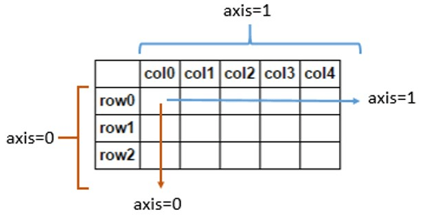


In the above diagram the row0, row1, row2 are the index for each record
in the data set and the col0, col1, col2 etc are the column names for
each columns(features) of the data set.

Now that we have downloaded the data set from its source and converted
that into a pandas Dataframe, let's display a few records from this
dataframe. For this we will use the `head()` method.

```
# Using .head() method to view the first few records of the data set
sales_data.head()
```

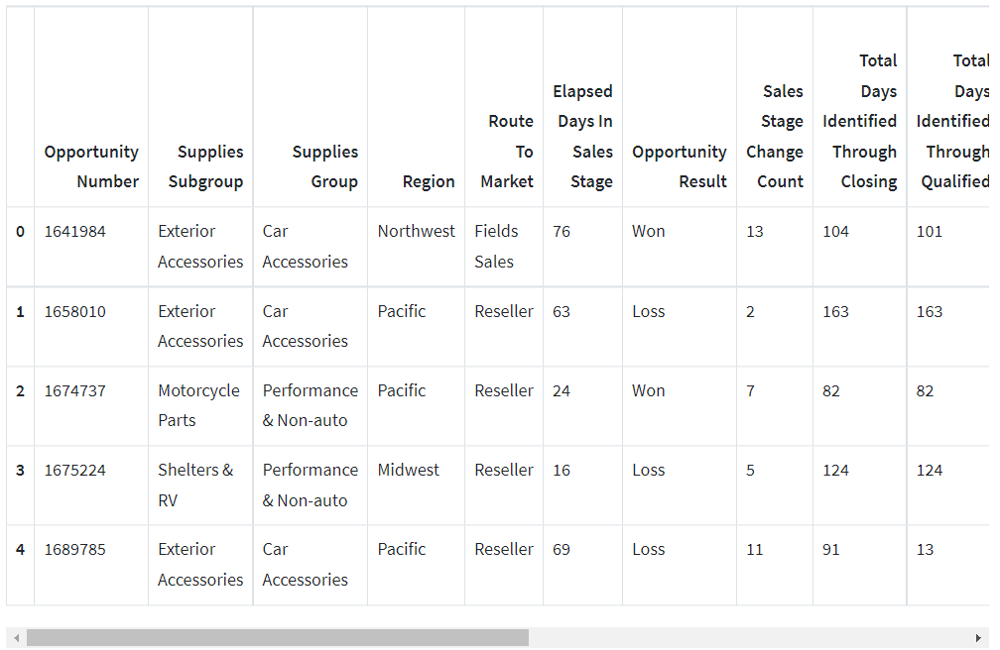

As can be seen from the above display, the `head()` method shows us the
first few records from the data set. The `head()` method is a very nifty
tool provided by pandas that helps us to get a feel of the content of a
data set. We will talk more about the `head()` method in the next
section.

Data Exploration
----------------

For exploring the data set, we will use some third party Python
libraries to help us process the data so that it can be effectively used
with scikit-learn's powerful algorithms. But we can start with the same
`head()` method we used in the previous section to view the first few
records of the imported data set, because `head()` is actually capable
of doing much more than that! We can customize the `head()` method to
show only a specific number of records as well:

```
# Using head() method with an argument which helps us to restrict the number of initial records that should be displayed
sales_data.head(n=2)
```

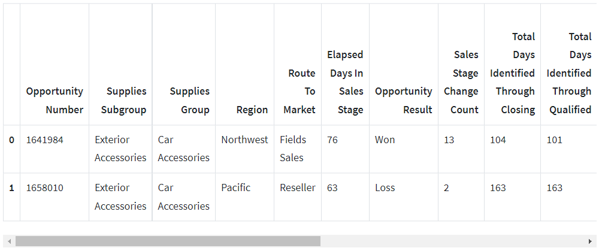

In the code snippet above, we used an argument inside the `head()`
method to display only the first two records from our data set. The
integer '2' in the argument `n=2` actually denotes the second `index` of
the Dataframe `Sales_data`. Using this we can get a quick look into the
kind of data we have to work with. For example, we can see that columns
like 'Supplies Group' and 'Region' contain string data, while columns
like Opportunity Result, Opportunity Number etc. contain integers. Also,
we can see that the 'Opportunity Number' column contains unique
identifiers for each record.

Now that we have viewed the initial records of our dataframe, let's try
to view the last few records in the data set. This can be done using the
`tail()` method, which has similar syntax as the `head()` method. Let's
see what the `tail()` method can do:

```
# Using .tail() method to view the last few records from the dataframe
sales_data.tail()
```

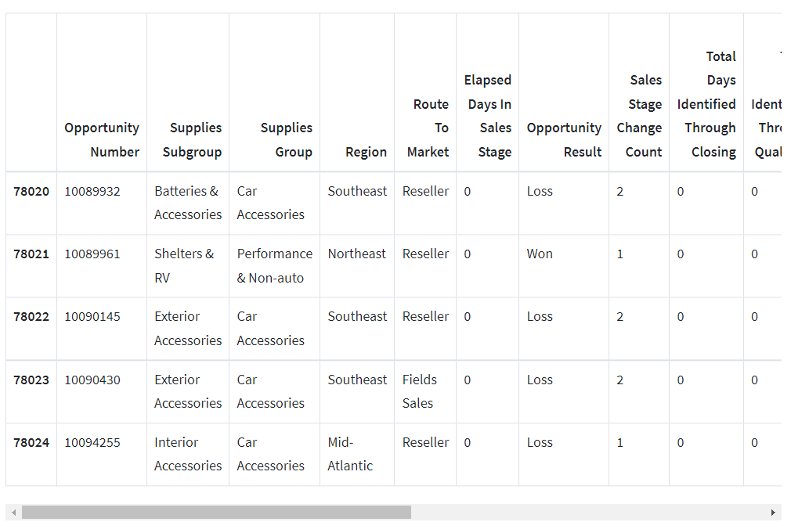

The `tail()` method in the code snippet above returns us the last few
records from the dataframe `sales_data`. We can pass an argument to the
`tail()` method to view only a limited number of records from our
dataframe, too:

```
# Using .tail() method with an argument which helps us to restrict the number of initial records that should be displayed
sales_data.tail(n=2)
```

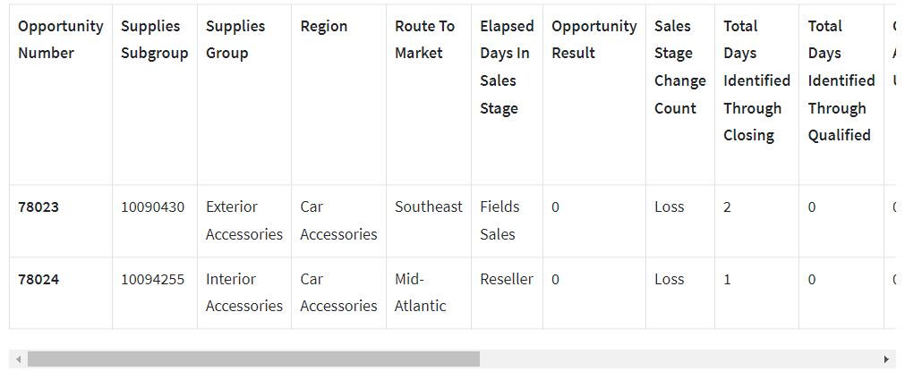

We can now view only the last two records from the dataframe, as
indicated by the argument `n=2` inside the `tail()` method. Similar to
the `head()` method, the integer '2' in the argument `n=2` in the
`tail()` method points to the second index from the last two records in
the data set `sales_data`.

What story do these last two records tell us? Looking at the
'Opportunity Number' column of the trailer records from the dataframe,
it becomes clear to us that a total of 78,024 records are available.
This is evident from the 'index' number of the records displayed with
the `tail()` method.

Now, it would be good if we could see the different datatypes that are
available in this data set; this information can be handy in case we
need to do some conversion later on. We can do that with the `dtypes()`
method in pandas:

```
# using the dtypes() method to display the different datatypes available
sales_data.dtypes
```

```
Opportunity Number int64
Supplies Subgroup object
Supplies Group object
Region object
Route To Market object
Elapsed Days In Sales Stage int64
Opportunity Result object
Sales Stage Change Count int64
Total Days Identified Through Closing int64
Total Days Identified Through Qualified int64
Opportunity Amount USD int64
Client Size By Revenue int64
Client Size By Employee Count int64
Revenue From Client Past Two Years int64
Competitor Type object
Ratio Days Identified To Total Days float64
Ratio Days Validated To Total Days float64
Ratio Days Qualified To Total Days float64
Deal Size Category int64
dtype: object
```

As we can see in the code snippet above, using the `dtypes` method, we
can list the different columns available in the Dataframe along with
their respective datatypes. For example, we can see that the Supplies
Subgroup column is an `object` datatype and the 'Client Size By Revenue'
column is an `integer` datatype. So, now we know which columns have
integers in them and which columns have string data in them.

Data Visualization
------------------

Now that we've done some basic data exploration, let's try to create
some nice plots to visually represent the data and uncover more stories
hidden in the data set.

There are many python libraries that provide functions for doing data
visualization; one such library is `Seaborn`. To use Seaborn plots, we
should make sure that this python module is downloaded and installed.

Let's set up the code to use the `Seaborn` module:

```
# import the seaborn module
import seaborn as sns
# import the matplotlib module
import matplotlib.pyplot as plt
# set the background colour of the plot to white
sns.set(style="whitegrid", color_codes=True)
# setting the plot size for all plots
sns.set(rc={'figure.figsize':(11.7,8.27)})
# create a countplot
sns.countplot('Route To Market',data=sales_data,hue = 'Opportunity Result')
# Remove the top and down margin
sns.despine(offset=10, trim=True)
# display the plotplt.show()
```

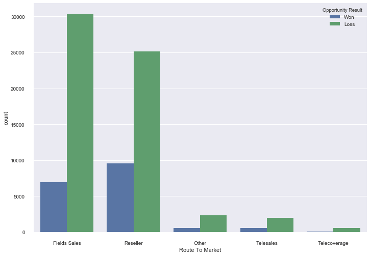

Now that we've got Seaborn set up, let's take a deeper look at what we
just did.

First we imported the Seaborn module and the matplotlib module. The
`set()` method in the next line helps to set different properties for
our plot, like 'styles', 'color' etc. Using the
`sns.set(style="whitegrid", color_codes=True)` code snippet we set the
background of the plot to a light color. Then we set the plot size with
the `sns.set(rc={'figure.figsize':(11.7,8.27)})`code snippet, which
defines the plot figure size to be 11.7px and 8.27px.

Next, we create the plot using
`sns.countplot('Route To Market',data=sales_data,hue = 'Opportunity Result')`.
The `countplot()` method helps us to create a countplot and it exposes
several arguments to customize the countplot per our needs. Here, in the
first argument of the `countplot()` method, we defined the X-axis as the
column 'Route To Market' from our data set. The second argument is the
data source, which in this case is the dataframe `sales_data` that we
created in the first section of this tutorial. The third argument is the
color of the barplots which we assigned to 'blue' for the label 'won'
and 'green' for the label 'loss' from the 'Opportunity Result' column of
the `sales_data` dataframe.

More details about Seaborn countplots can be found
[here](https://seaborn.pydata.org/generated/seaborn.countplot.html).

So, what does the countplot tell us about the data? The first thing is
that the data set has more records of the type 'loss' than records of
the type 'won', as we can see from the size of the bars. Looking at the
x axis and the corresponding bars for each label on the x axis, we can
see that most of the data from our data set is concentrated towards the
left side of the plot: towards the 'Field Sales' and 'Reseller'
categories. Another thing to notice is that the category 'Field Sales'
has more losses than the category 'Reseller'.

We selected the Route To Market column for our plot because it seemed
like it would provide helpful information after our initial study of the
`head()` and `tail()` methods' output. But other fields like 'Region' ,
'Supplies Group' etc. can also be used to make plots in the same manner.

Now that we have got a pretty good visualization of what our overall
data looks like, let's see what more information can we dig out with the
help of other Seaborn plots. Another popular option is `violinplots`, so
let's create a violin plot and see what that style of plot can tell us.

We will use the `violinplot()` method provided by the Seaborn module to
create the violin plot. Let's first import the `seaborn` module and use
the `set()` method to customize the size of our plot. We will seet the
size of the plot as 16.7px by 13.27px:

```
# import the seaborn module
import seaborn as sns
# import the matplotlib module
import matplotlib.pyplot as plt
# setting the plot size for all plots
sns.set(rc={'figure.figsize':(16.7,13.27)})
```

Next, we will use the `violinplot()` method to create the violinplot and
then use the `show()` mehtod to display the plot --

```
# plotting the violinplot
sns.violinplot(x="Opportunity Result",y="Client Size By Revenue", hue="Opportunity Result", data=sales_data);
plt.show()
```


Now, that our plot is created, let's see what it tells us. In its
simplest form, a violin plot displays the distribution of data across
labels. In the above plot we have labels 'won' and 'loss' on the x-axis
and the values of 'Client Size By Revenue' in the y-axis. The violin
plot shows us that the largest distribution of data is in the client
size '1', and the rest of the client size labels have less data.

This violin plot gives us very valuable insight into how the data is
distributed and which features and labels have the largest concentration
of data, but there is more than what meets the eye in case of violin
plots. You can dig deeper into the additional uses of violin plots via
[the official documentation of the `Seaborn`
module](https://seaborn.pydata.org/generated/seaborn.violinplot.html)

Preprocessing Data
------------------

Now that we have a good understanding of what our data looks like, we
can move towards preparing it to build prediction models using
scikit-learn.

We saw in our initial exploration that most of the columns in our data
set are strings, but the algorithms in scikit-learn understand only
numeric data. Luckily, the scikit-learn library provides us with many
methods for converting string data into numerical data. One such method
is the `LabelEncoder()` method. We will use this method to convert the
categorical labels in our data set like 'won' and 'loss' into numerical
labels. To visualize what we are trying to to achieve with the
`LabelEncoder()` method let's consider the images below.

The image below represents a dataframe that has one column named 'color'
and three records 'Red', 'Green' and 'Blue'.


Since the machine learning algorithms in scikit-learn understand only
numeric inputs, we would like to convert the categorical labels like
'Red, 'Green' and 'Blue' into numeric labels. When we are done
converting the categorical labels in the original dataframe, we would
get something like this:


Now, let's start the actual conversion process. We will use the
`fit_transform()` method provided by `LabelEncoder()` to encode the
labels in the categorical column such as 'Route To Market' in the
`sales_data` dataframe and convert them into numeric labels similar to
what we visualized in the above diagrams. The `fit_transform()` function
takes user defined labels as input and then returns encoded labels.
Let's go through a quick example to understand how the encoding is done.
In the code example below we have a list of cities i.e.
`["paris", "paris", "tokyo", "amsterdam"]` and we will try to encode
these string labels into something similar to this -- `[2, 2, 1,3]`.

```
#import the necessary module
from sklearn import preprocessing
# create the Labelencoder object
le = preprocessing.LabelEncoder()
#convert the categorical columns into numeric
encoded_value = le.fit_transform(["paris", "paris", "tokyo", "amsterdam"])
print(encoded_value)
```

```
[1 1 2 0]
```

Voila! We have successfully converted the string labels into numeric
labels. How'd we do that? First we imported the `preprocessing` module
which provides the `LabelEncoder()` method. Then we created an object
which represents the `LabelEncoder()` type. Next we used this object's
`fit_transform()` function to differentiate between different unique
classes of the list `["paris", "paris", "tokyo", "amsterdam"]` and then
return a list with the respective encoded values, i.e. `[1 1 2 0]`.

Notice how the `LabelEncoder()` method assigns the numeric values to the
classes in the order of the first letter of the classes from the
original list: "(a)msterdam" gets an encoding of '0' , "(p)aris gets an
encoding of 1" and "(t)okyo" gets an encoding of 2.

There are many more functions provided by `LabelEncoder()` that are
handy under a variety of encoding requirements. We won't need them here,
but to learn more, a good place to start is [the official page of
scikit-learn](https://scikit-learn.org/stable/modules/generated/sklearn.preprocessing.LabelEncoder.html)
where the `LabelEncoder()` and its related functions are described in
detail.

Since, we now have a good idea of how the `LabelEncoder()` works, we can
move forward with using this method to encode the categorical labels
from the `sales_data` dataframe and convert them into numeric labels. In
the previous sections during the initial exploration of the data set we
saw that the following columns contain string values: 'Supplies
Subgroup', 'Region', 'Route To Market', 'Opportunity Result',
'Competitor Type', and 'Supplies Group'. Before we start encoding these
string labels, let's take a quick look into the different labels that
these columns contain:-

```
print("Supplies Subgroup' : ",sales_data['Supplies Subgroup'].unique())
print("Region : ",sales_data['Region'].unique())
print("Route To Market : ",sales_data['Route To Market'].unique())
print("Opportunity Result : ",sales_data['Opportunity Result'].unique())
print("Competitor Type : ",sales_data['Competitor Type'].unique())
print("'Supplies Group : ",sales_data['Supplies Group'].unique())
```

```
Supplies Subgroup' : ['Exterior Accessories' 'Motorcycle Parts' 'Shelters & RV'
'Garage & Car Care' 'Batteries & Accessories' 'Performance Parts'
'Towing & Hitches' 'Replacement Parts' 'Tires & Wheels'
'Interior Accessories' 'Car Electronics']
Region : ['Northwest' 'Pacific' 'Midwest' 'Southwest' 'Mid-Atlantic' 'Northeast'
'Southeast']
Route To Market : ['Fields Sales' 'Reseller' 'Other' 'Telesales' 'Telecoverage']
Opportunity Result : ['Won' 'Loss']
Competitor Type : ['Unknown' 'Known' 'None']
'Supplies Group : ['Car Accessories' 'Performance & Non-auto' 'Tires & Wheels'
'Car Electronics']
```

We have now laid out the different categorical columns from the
`sales_data` dataframe and the unique classes under each of these
columns. Now, it's time to encode these strings into numeric labels. To
do this, we will run the code below and then do a deep dive to
understand how it works:

```
#import the necessary module
from sklearn import preprocessing
# create the Labelencoder object
le = preprocessing.LabelEncoder()
#convert the categorical columns into numeric
sales_data['Supplies Subgroup'] = le.fit_transform(sales_data['Supplies Subgroup'])
sales_data['Region'] = le.fit_transform(sales_data['Region'])
sales_data['Route To Market'] = le.fit_transform(sales_data['Route To Market'])
sales_data['Opportunity Result'] = le.fit_transform(sales_data['Opportunity Result'])
sales_data['Competitor Type'] = le.fit_transform(sales_data['Competitor Type'])
sales_data['Supplies Group'] = le.fit_transform(sales_data['Supplies Group'])
#display the initial records
sales_data.head()
```

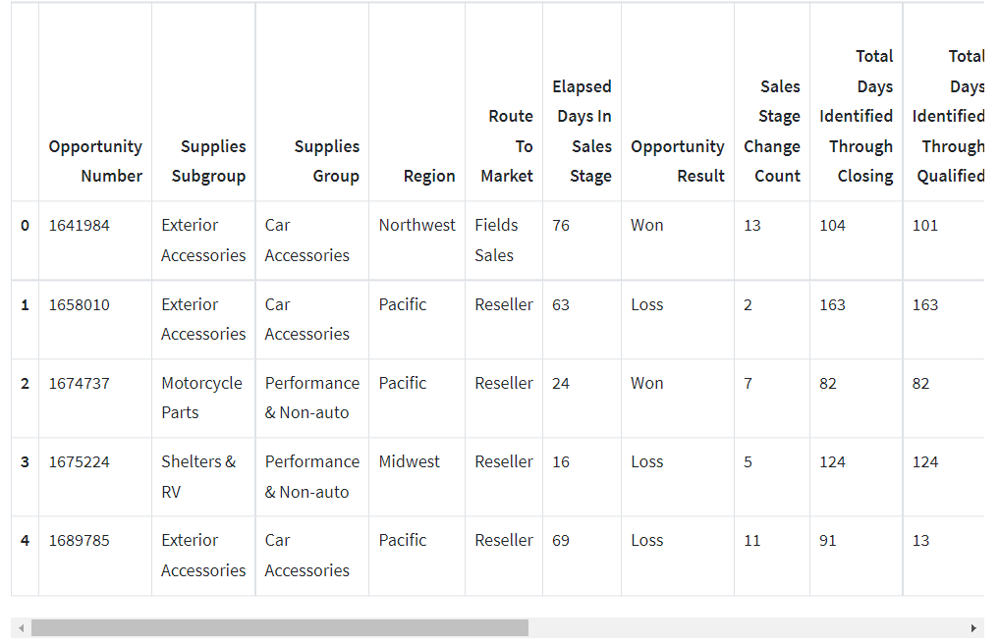

So what did we just do? First we imported the `preprocessing` module
which provides the `LabelEncoder()` method. Then we created an object
`le` of the type `labelEncoder()`. In the next couple of lines we used
the `fit_transform()` function provided by `LabelEncoder()` and
converted the categorical labels of different columns like 'Supplies
Subgroup', 'Region', Route To Market' into numeric labels. In doing
this, we successfully converted all the categorical (string) columns
into numeric values.

Now that we have our data prepared and converted it is *almost* ready to
be used for building our predictive model. But we still need to do one
critical thing:

Training Set & Test Set
-----------------------

A Machine Learning algorithm needs to be trained on a set of data to
learn the relationships between different features and how these
features affect the target variable. For this we need to divide the
entire data set into two sets. One is the training set on which we are
going to train our algorithm to build a model. The other is the testing
set on which we will test our model to see how accurate its predictions
are.

But before doing all this splitting, let's first separate our features
and target variables. As before in this lab, we will first run the
code below, and then take a closer look at what it does:

```
# select columns other than 'Opportunity Number','Opportunity Result'cols = [col for col in sales_data.columns if col not in ['Opportunity Number','Opportunity Result']]
# dropping the 'Opportunity Number'and 'Opportunity Result' columns
data = sales_data[cols]
#assigning the Oppurtunity Result column as target
target = sales_data['Opportunity Result']
data.head(n=2)
```

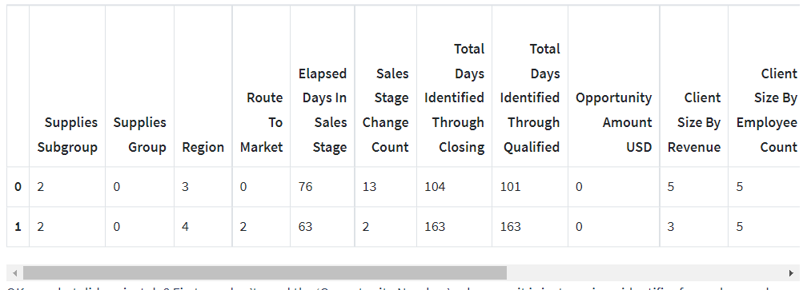

OK, so what did we just do? First, we don't need the 'Opportunity
Number' column as it is just a unique identifier for each record. Also,
we want to predict the 'Opportunity Result', so it should be our
'target' rather than part of 'data'. So, in the first line of the code
above, we selected only the columns which didn't match 'Opportunity
Number'and 'Opportunity Result' and assigned them to a variable `cols`.
Next, we created a new dataframe `data` with the columns in the list
`cols`. This will serve as our feature set. Then we took the
'Opportunity Result' column from the dataframe `sales_data` and created
a new dataframe `target`.

That's it! We are all set with defining our features and target into two
separate dataframes. Next we will divide the dataframes `data` and
`target` into training sets and testing sets. When splitting the data
set we will keep 30% of the data as the test data and the remaining 70%
as the training data. But keep in mind that those numbers are arbitrary
and the best split will depend on the specific data you're working with.
If you're not sure how to split your data, the 80/20 principle where you
keep 80% of the data as training data and use the remaining 20% as test
data is a decent default. However, for this lab, we are going to
stick with our earlier decision of keeping aside 30% of the data as test
data. The `train_test_split()` method in scikit-learn can be used to
split the data:

```
#import the necessary module
from sklearn.model_selection import train_test_split
#split data set into train and test setsdata_train, data_test, target_train, target_test = train_test_split(data,target, test_size = 0.30, random_state = 10)
```

With this, we have now successfully prepared a testing set and a
training set. In the above code first we imported the train\_test\_split
module. Next we used the `train_test_split()` method to divide the data
into a training set (data\_train,target\_train) and a test set
(data\_test,data\_train). The first argument of the `train_test_split()`
method are the features that we separated out in the previous section,
the second argument is the target('Opportunity Result'). The third
argument 'test\_size' is the percentage of the data that we want to
separate out as training data . In our case it's 30% , although this can
be any number. The fourth argument 'random\_state' just ensures that we
get reproducible results every time.

Now, we have everything ready and here comes the most important and
interesting part of this tutorial: building a prediction model using the
vast library of algorithms available through scikit-learn.

Building The Model
------------------

There's a `machine_learning_map` available [on scikit learn's
website](https://scikit-learn.org/stable/tutorial/machine_learning_map/)
that we can use as a quick reference when choosing an algorithm. It
looks something like this:

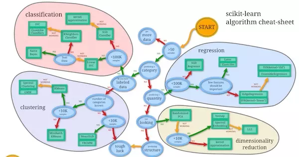

We can use this map as a cheat sheet to shortlist the algorithms that we
can try out to build our prediction model. Using the checklist let's see
under which category we fall:

-   More than 50 samples -- Check
-   Are we predicting a category -- Check
-   We have labeled data? ( *data with clear names like opportunity
    amount etc.*) -- Check
-   Less than 100k samples -- Check

Based on the checklist that we prepared above and going by the
`machine_learning_map` we can try out the below mentioned algorithms.

-   Naive Bayes
-   Linear SVC
-   K-Neighbours Classifier

The real beauty of the scikit-learn library is that it exposes high
level APIs for different algorithms, making it easier for us to try out
different algorithms and compare the accuracy of the models to see what
works best for our data set.

Let's begin trying out the different algorithms one by one.

### Naive-Bayes

Scikit-learn provides a set of classification algorithms which "naively"
assumes that in a data set every pair of features are independent. This
assumption is the underlying principle of [Bayes theorem](https://en.wikipedia.org/wiki/Bayes%27_theorem). The algorithms based on this principle are known as Naive-Bayes algorithms.

On a very high level a Naive-Bayes algorithm calculates the probability
of the connection of a feature with a target variable and then it
selects the feature with the highest probability. Let's try to
understand this with a very simple problem statement: Will it rain
today? Suppose we have a set of weather data with us that will be our
feature set, and the probability of 'Rain' will be our target. Based on
this feature set we can create a table to show us the number of times a
particular feature/target pair occur. It would look something like this:

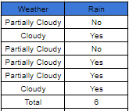

In the table above the feature (column) 'Weather' contains the labels
('Partially Cloudy' and 'Cloudy') and the column 'Rain' contains the
occurrence of rain coinciding with the feature 'Weather' (Yes/No).
Whenever a feature lcoincides with rain, it's recorded as a 'Yes' and
when the feature didn't lead to rain it is recorded as a 'No'. We can
now use the data from the occurrence table to create another table known
as the 'Frequency table' where we can record the number of 'Yes' and the
number of 'No' answers that each feature relates to:

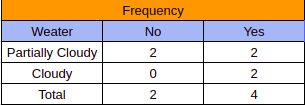

Finally, we combine the data from the 'occurrence table' and the
'frequency table' and create a 'likelihood table'. This table lists the
amount of 'Yes' and 'No' for each feature and then uses this data to
calculate the probability of contibution of each feature towards the
occurrence of rain:


Notice the 'Individual Probability' column in the table above. We had 6
occurrences of the features 'Partially Cloudy' and 'Cloudy' from the
'Occurrence table' and from the 'Likelihood table' it was clear that the
feature 'Partially Cloudy' had 4 occurrences (2 for 'No' and 2 for
'yes'). When we divide the number of occurrences of 'No' and 'Yes' of a
particular feature with the 'total' of the 'occurrence table', we get
the probability of that particular feature. In our case if we need to
find out that which feature has the strongest probability of
contributing to the occurrence of Rain then we take the total number of
'No' of each feature and add it to their respective number of 'Yes' from
the 'frequency table' and then divide the sum with the 'Total' from the
óccurances table'. This gives us the probability of each of these
features coinciding with rain.

The algorithm that we are going to use for our sales data is the
`Gaussian Naive Bayes` and it is based on a concept similar to the
weather example we just explored above, although significantly more
mathematically complicated. A more detailed explanation of 'Naive-Bayes'
algorithms can be found
[here](https://scikit-learn.org/stable/modules/naive_bayes.html) for
those who wish to delve deeper.

Now let's implement the Gaussian Naive Bayes or `GaussianNB` algorithm
from scikit-learn to create our prediction model:

```
# import the necessary module
from sklearn.naive_bayes import GaussianNB
from sklearn.metrics import accuracy_score
#create an object of the type GaussianNB
gnb = GaussianNB()
#train the algorithm on training data and predict using the testing data
pred = gnb.fit(data_train, target_train).predict(data_test)
#print(pred.tolist())
#print the accuracy score of the model
print("Naive-Bayes accuracy : ",accuracy_score(target_test, pred, normalize = True))
```

```
Naive-Bayes accuracy : 0.759056732741
```

Now let's take a closer look at what we just did. First, we imported the
`GaussianNB` method and the `accuracy_score` method. Then we created an
object `gnb` of the type `GaussianNB`. After this, we trained the
algorithm on the testing data(data\_train) and testing
target(target\_train) using the `fit()` method, and then predicted the
targets in the test data using the `predict()` method. Finally we
printed the score using the `accuracy_score()` method and with this we
have successfully applied the `Naive-Bayes` algorithm to build a
prediction model.

Now lets see how the other algorithms in our list perform as compared to
the Naive-Bayes algorithm.

### LinearSVC

LinearSVC or Linear Support Vector Classification is a subclass of the
`SVM` (Support Vector Machine) class. We won't go into the intricacies
of the mathematics involved in this class of algorithms, but on a very
basic level LinearSVC tries to divide the data into different planes so
that it can find a best possible grouping of different classes. To get a
clear understanding of this concept let's imagine a data set of 'dots'
and 'squares' divided into a two dimensional space along two axis, as
shown in the image below:

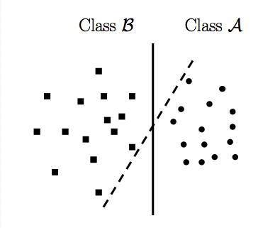

In the image above a `LinearSVC` implementation tries to divide the
two-dimensional space in such a way that the two classes of data i.e the
`dots` and `squares` are clearly divided. Here the two lines visually
represent the various division that the `LinearSVC` tries to implement
to separate out the two available classes.

```
#import the necessary modules
from sklearn.svm import LinearSVC
from sklearn.metrics import accuracy_score
#create an object of type LinearSVC
svc_model = LinearSVC(random_state=0)
#train the algorithm on training data and predict using the testing data
pred = svc_model.fit(data_train, target_train).predict(data_test)
#print the accuracy score of the model
print("LinearSVC accuracy : ",accuracy_score(target_test, pred, normalize = True))
```

```
LinearSVC accuracy : 0.777811004785
```

Similar to what we did during the implementation of GaussianNB, we
imported the required modules in the first two lines. Then we created an
object `svc_model` of type LinearSVC with random\_state as '0'. Hold on!
What is a "random\_state" ? Simply put the `random_state` is an
instruction to the built-in random number generator to shuffle the data
in a specific order.

Next, we trained the LinearSVC on the training data and then predicted
the target using the test data. Finally, we checked the accuracy score
using the `accuracy_score()` method.

Now that we have tried out the `GaussianNB` and `LinearSVC` algorithms
we will try out the last algorithm in our list and that's the
`K-nearest neighbours classifier`

### K-Neighbors Classifier

Compared to the previous two algorithms we've worked with, this
classifier is a bit more complex. For the purposes of this lab we
are better off using the `KNeighborsClassifier` class provided by
scikit-learn without worrying much about how the algorithm works. (But
if you're interested, a very detailed explanation of this class of
algorithms can be found
[here](https://en.wikipedia.org/wiki/K-nearest_neighbors_algorithm))

Now, let's implement the K-Neighbors Classifier and see how it scores:

```
#import necessary modules
from sklearn.neighbors import KNeighborsClassifier
from sklearn.metrics import accuracy_score
#create object of the lassifier
neigh = KNeighborsClassifier(n_neighbors=3)
#Train the algorithm
neigh.fit(data_train, target_train)
# predict the response
pred = neigh.predict(data_test)
# evaluate accuracy
print ("KNeighbors accuracy score : ",accuracy_score(target_test, pred))
```

```
KNeighbors accuracy score : 0.814550580998
```

The above code can be explained just like the previous implementations.
First we imported the necessary modules, then we created the object
`neigh` of type KNeighborsClassifier with the number of neighbors being
`n_neighbors=3`. Then we used the `fit()` method to train our algorithm
on the training set, then we tested the model on the test data. Finally,
we printed out the accuracy score.

Now that we have implemented all the algorithms in our list, we can
simply compare the scores of all the models to select the model with the
highest score. But wouldn't it be nice if we had a way to visually
compare the performance of the different models? We can use the
[`yellowbrick`](https://www.scikit-yb.org/en/latest/tutorial.html#visual-model-evaluation)
library in scikit-learn, which provides methods for visually
representing different scoring methods.

Performance Comparison
----------------------

In the previous sections we have used the `accuracy_score()` method to
measure the accuracy of the different algorithms. Now, we will use the
`ClassificationReport` class provided by the `Yellowbrick` library to
give us a visual report of how our models perform.

### GaussianNB

Let's start off with the `GaussianNB` model:

```
from yellowbrick.classifier import ClassificationReport
# Instantiate the classification model and visualizer
visualizer = ClassificationReport(gnb, classes=['Won','Loss'])
visualizer.fit(data_train, target_train) # Fit the training data to the visualizer
visualizer.score(data_test, target_test) # Evaluate the model on the test data
g = visualizer.poof() # Draw/show/poof the data
```

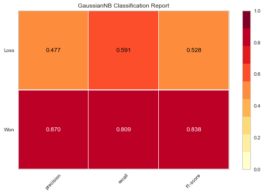

In the code above, first we import the `ClassificationReport` class
provided by the `yellowbrick.classifier` module. Next, an object
`visualizer` of the type `ClassificationReport` is created. Here the
first argument is the `GaussianNB` object `gnb` that was created while
implementing the `Naive-Bayes` algorithm in the 'Naive-Bayes' section.
The second argument contains the labels 'Won' and 'Loss' from the
'Opportunity Result' column from the `sales_data` dataframe.

Next, we use the `fit()` method to train the `visualizer` object. This
is followed by the `score()` method, which uses `gnb` object to carry
out predictions as per the `GaussianNB` algorithm and then calculate the
accuracy score of the predictions made by this algorithm. Finally, we
use the `poof()` method to draw a plot of the different scores for the
`GaussianNB` algorithm. Notice how the different scores are laid out
against each of the labels 'Won' and 'Loss'; this enables us to
visualize the scores across the different target classes.

### LinearSVC

Similar to what we just did in the previous section, we can also plot
the accuracy scores of the `LinearSVC` algorithm:

```
from yellowbrick.classifier import ClassificationReport
# Instantiate the classification model and visualizer
visualizer = ClassificationReport(svc_model, classes=['Won','Loss'])
visualizer.fit(data_train, target_train) # Fit the training data to the visualizer
visualizer.score(data_test, target_test) # Evaluate the model on the test data
g = visualizer.poof() # Draw/show/poof the data
```

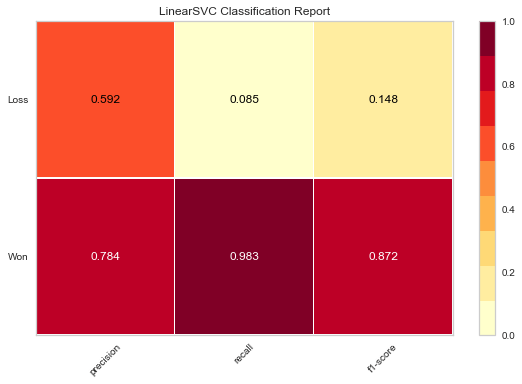

In the code above, first we imported the `ClassificationReport` class
provided by the `yellowbrick.classifier` module. Next, an object
`visualizer` of the type `ClassificationReport` was created. Here the
first argument is the `LinearSVC` object `svc_model`, that was created
while implementing the `LinearSVC` algorithm in the 'LinearSVC' section.
The second argument contains the labels 'Won' and 'Loss' from the
'Opportunity Result' column from the `sales_data` dataframe.

Next, we used the `fit()` method to train the 'svc\_model' object. This
is followed by the `score()` method which uses the `svc_model` object to
carry out predictions according to the `LinearSVC` algorithm and then
calculate the accuracy score of the predictions made by this algorithm.
Finally, we used the `poof()` method to draw a plot of the different
scores for the `LinearSVC` algorithm.

### KNeighborsClassifier

Now, let's do the same thing for the K-Neighbors Classifier scores.

```
from yellowbrick.classifier import ClassificationReport
# Instantiate the classification model and visualizer
visualizer = ClassificationReport(neigh, classes=['Won','Loss'])
visualizer.fit(data_train, target_train) # Fit the training data to the visualizer
visualizer.score(data_test, target_test) # Evaluate the model on the test data
g = visualizer.poof() # Draw/show/poof the data
```

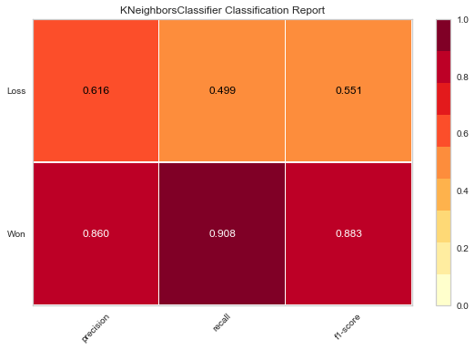

Once again, we first import the `ClassificationReport` class provided by
the `yellowbrick.classifier` module. Next, an object `visualizer` of the
type `ClassificationReport` is created. Here the first argument is the
`KNeighborsClassifier` object `neigh`, that was created while
implementing the `KNeighborsClassifier` algorithm in the
'KNeighborsClassifier' section. The second argument contains the labels
'Won' and 'Loss' from the 'Opportunity Result' column from the
`sales_data` dataframe.

Next, we use the `fit()` method to train the 'neigh' object. This is
followed by the `score()` method which uses the `neigh` object to carry
out predictions according to the `KNeighborsClassifier` algorithm and
then calculate the accuracy score of the predictions made by this
algorithm. Finally we use the `poof()` method to draw a plot of the
different scores for the `KNeighborsClassifier` algorithm.

Now that we've visualized the results, it's much easier for us to
compare the scores and choose the algorithm that's going to work best
for our needs.

Conclusion
----------

To use scikit-learn Machine Learning library to
the fullest, there are many resources available on the [official page of
scikit-learn](https://scikit-learn.org/) with detailed documentation
that you can dive into. The quick start guide for scikit-learn can be
found
[here](https://scikit-learn.org/stable/tutorial/basic/tutorial.html),
and that's a good entry point for beginners who have just started
exploring the world of Machine Learning.

But to really appreciate the true power of the scikit-learn library,
what you really need to do is start using it on different open data sets
and building predictive models using these data sets. Sources for open
data sets include [Kaggle](https://www.kaggle.com/) and
[Data.world](https://data.world/open-data-community). Both contain many
interesting data sets on which one can practice building predictive
models by using the algorithms provided by the scikit-learn library.